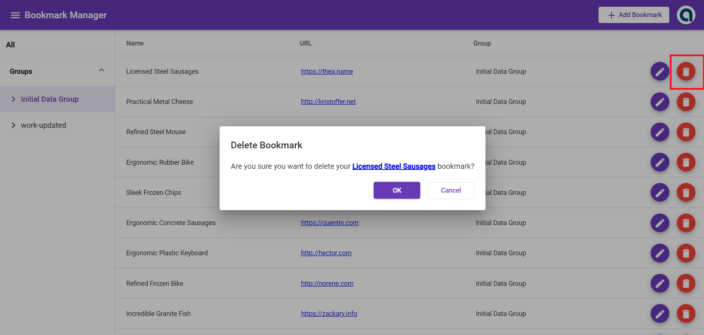

# Bookmark Manager

- **Built with Angular 8**
- **NGRX for managing the state**
- **Angular Material for the user interface**

## Prerequisites
- **Node 8.9+ and  NPM 5.5.1+  installed** - download from here https://nodejs.org/en/download/ and install

## Description of the solution


## Screenshots of the working solution
#### Bookmark Listing - Initial View


#### Add Bookmark Dialog


#### After Add - Bookmark Has Been Added in the List


#### Delete Bookmark Dialog


#### Edit Bookmark Dialog


#### After Edit - Bookmark Has Been Updated in the List


#### Groups


## Instructions how to run the application
1.) Go to https://github.com/joannalanuza/bookmark-manager.git

2.) Download the repository by clicking 'Code' button then 'Download ZIP'

3.) Extract the downloaded zip file

4.) Open CLI and cd to bookmark-manager root folder where you can find the following files, package.json, angular.json, etc.

5.) Run the following:
```sh
npm install
npm run generate
npm run server
```
6.) Open another CLI Window, cd to bookmark-manager root folder, and run the following
```sh
ng serve
```
7.) Once compilation is successful, open browser and go to http://localhost:4200/bookmarks

8.) You should now be able to access the bookmarks manager page

## Running unit tests


## Mockup API


